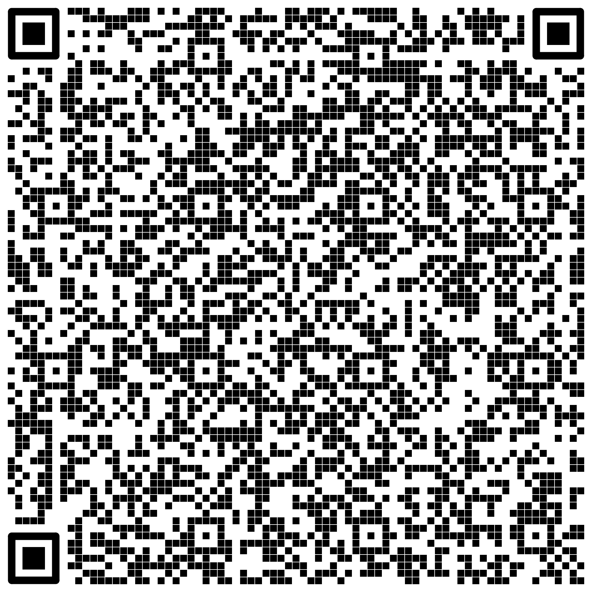

# kotlin-bihupp-qrcode

<p style="text-align: center;">
  
</p>

Kotlin biblioteka koja implementira BIHUPP10 standard QR koda za instrukcije bankovnog plaćanja u Bosni i Hercegovini.

BIHUPP (_Bosansko-Hercegovački Unutrašnji Platni Promet_) definiše strukturirani tekstualni sadržaj koji se može enkodirati u obliku QR koda, koji banke skeniraju kako bi automatski popunile naloge za plaćanje. Ovaj format je ustanovljen od strane [Udruženja Banaka Bosne i Hercegovine](https://ubbih.ba/).

Dodavanje QR koda u definisanom formatu na računima omogućava krajnjim korisnicima plaćanje pomoću skeniranja QR koda kroz njihovo mobilno bankarstvo.

Za PHP biblioteku idite na [php-bihupp-qrcode](https://github.com/sasa-b/php-bihupp-qrcode).

---------------------------------------------------------

Kotlin library implementing the **BIHUPP** QR Code standard for bank payment instructions in Bosnia and Herzegovina.

BIHUPP (_Bosansko-Hercegovački Unutrašnji Platni Promet_) defines a structured text payload that can be encoded as a QR code that banks scan to pre-fill payment forms. This format was established by the [Association of Banks of Bosnia and Herzegovina](https://ubbih.ba/).

Adding a QR code in the defined format to invoices enables end-users to make payments by scanning the QR code through their mobile banking app.

For PHP library go to [php-bihupp-qrcode](https://github.com/sasa-b/php-bihupp-qrcode).

## Table of contents

- [Requirements](#requirements)
- [Installation](#installation)
- [Quick start](#quick-start)
- [Usage](#usage)
  - [Standard bank transfer](#standard-bank-transfer)
  - [Omitting the sender](#omitting-the-sender)
  - [Multiple recipient accounts](#multiple-recipient-accounts)
  - [Including a sender phone number](#including-a-sender-phone-number)
  - [Public revenue payment](#public-revenue-payment-tax-fees-etc)
  - [Reading the payload string](#reading-the-payload-string)
- [QR code output](#qr-code-output)
  - [PNG (default)](#png-default)
  - [SVG](#svg)
  - [Base64 data-URI link](#base64-data-uri-link)
- [Field reference](#field-reference)
  - [`PaymentInstruction` constructor](#paymentinstruction-constructor)
  - [Field constraints](#field-constraints)
  - [Allowed character set](#allowed-character-set)
- [Amount handling](#amount-handling)
- [Payment priority](#payment-priority)
- [Exception handling](#exception-handling)
- [Contribute](#contribute)
- [License](#license)

## Requirements

- JVM 21+
- Kotlin 2.x

## Installation

**Gradle (Kotlin DSL):**

```kotlin
implementation("tech.s-co:kotlin-bihupp-qrcode:<version>")
```

**Gradle (Groovy DSL):**

```groovy
implementation 'tech.s-co:kotlin-bihupp-qrcode:<version>'
```

**Maven:**

```xml
<dependency>
    <groupId>tech.s-co</groupId>
    <artifactId>kotlin-bihupp-qrcode</artifactId>
    <version>VERSION</version>
</dependency>
```

## Quick start

```kotlin
import tech.sco.bihupp.ImageFormat
import tech.sco.bihupp.payment.*
import qrcode.QRCode
import tech.sco.bihupp.of

val instruction = PaymentInstruction(
    sender = Sender(
        name = Name.of("Marko", "Marković"),
        address = Address(
            addressLine1 = AddressLine1.of("Ulica Meše Selimovića", "12"),
            addressLine2 = AddressLine2.of("78000", "Banja Luka"),
        ),
        account = Account("1234567890123456"),
    ),
    recipient = Recipient(
        name = Name.business("Vodovod d.o.o."),
        address = Address(
            addressLine1 = AddressLine1.of("Kralja Petra I Karađorđevića", "97"),
            addressLine2 = AddressLine2.of("78000", "Banja Luka"),
        ),
        account = RecipientAccount.of(Account("9876543210987654")),
    ),
    purpose = PaymentPurpose.of("Račun za vodu - april 2024"),
    reference = PaymentReference("1234-5678-001"),
    amount = Amount.of(9862), // amount in pennies (= 98.62 BAM)
)

// Render as PNG (default)
val qrCode = QRCode.of(instruction)           // QRCodeByteArray
// or via the convenience method:
val qrCode = instruction.toQRCode()
```

## Usage

### Standard bank transfer

```kotlin
val instruction = PaymentInstruction(
    sender = sender,
    recipient = recipient,
    purpose = PaymentPurpose.of("Invoice payment"),
    reference = PaymentReference("INV-2024-001"),
    amount = Amount.of(10000),                     // 100.00 BAM
    paymentPriority = PaymentPriority.regular(),   // default, can be omitted
)
```

### Omitting the sender

When `sender` is omitted, the bank pre-fills payer details from the logged-in user's session.

```kotlin
val instruction = PaymentInstruction(
    sender = null,
    recipient = recipient,
    purpose = PaymentPurpose.of("Troškovi vode"),
    reference = PaymentReference("1445-26554-11222"),
    amount = Amount.of(9862),
)
```

### Multiple recipient accounts

Up to 20 recipient accounts can be specified using the vararg or list overload.

```kotlin
val account = RecipientAccount.of(
    Account("1234567890123456"),
    Account("9876543210987654"),
    Account("1111222233334444"),
)

// or from a list:
val account = RecipientAccount.of(listOf(
    Account("1234567890123456"),
    Account("9876543210987654"),
))
```

### Including a sender phone number

```kotlin
val sender = Sender(
    name = Name.of("Ana", "Anić"),
    address = Address(
        addressLine1 = AddressLine1.of("Kralja Tomislava", "5"),
        addressLine2 = AddressLine2.of("88000", "Mostar"),
    ),
    account = Account("1234567890123456"),
    phoneNumber = PhoneNumber.of("+38761234567"), // E.164 format, "+" prefix required
)
```

### Public revenue payment (tax, fees, etc.)

Public revenue payments require additional fields grouped in a `PublicRevenueInstruction` object.

```kotlin
import tech.sco.bihupp.payment.*
import java.time.LocalDate

val instruction = PaymentInstruction(
    sender = Sender(
        name = Name.business("Example Company d.o.o."),
        address = Address(
            addressLine1 = AddressLine1.of("Veselina Masleše", "20"),
            addressLine2 = AddressLine2.of("78000", "Banja Luka"),
        ),
        account = Account("1234567890123456"),
    ),
    recipient = Recipient(
        name = Name("Trezor"),
        address = Address(
            addressLine1 = AddressLine1.of("Aleja Svetog Save", "13"),
            addressLine2 = AddressLine2.of("78000", "Banja Luka"),
        ),
        account = RecipientAccount.of(Account("1610000010680092")),
    ),
    purpose = PaymentPurpose.of("Porez na dobit"),
    reference = null,
    amount = Amount.of(500000), // 5000.00 BAM
    publicRevenue = PublicRevenueInstruction(
        senderTaxId = SenderTaxId("4200730150004"),                          // 13-digit tax ID (JIB/JMBG)
        paymentType = PaymentType("3"),
        revenueType = RevenueType("712115"),
        taxPeriodStartDate = TaxPeriodDate.of(LocalDate.of(2024, 1, 1)),
        taxPeriodEndDate = TaxPeriodDate.of(LocalDate.of(2024, 12, 31)),
        municipalCode = MunicipalCode("077"),
        budgetCode = BudgetOrgCode("1200200"),
        paymentReference = PublicRevenueInstruction.PaymentReference("7110578163"),
    ),
)
```

### Reading the payload string

Call `toString()` to get the newline-delimited BIHUPP payload, or `lines()` to get it as a structured list:

```kotlin
println(instruction.toString())
// BIHUPP10
// Example Company d.o.o.
// Zmaja od Bosne 75
// 71000 Sarajevo
// ...

val lines: List<Line> = instruction.lines()
```

## QR code output

All methods return a `QRCodeByteArray`, which holds the rendered `bytes: ByteArray` and the `format: ImageFormat`.

### PNG (default)

```kotlin
val png: QRCodeByteArray = QRCode.of(instruction)
// or
val png: QRCodeByteArray = QRCode.of(instruction, ImageFormat.PNG)
// or via the convenience method on PaymentInstruction:
val png: QRCodeByteArray = instruction.toQRCode()

// Access the raw bytes:
val bytes: ByteArray = png.bytes
```

### SVG

```kotlin
val svg: QRCodeByteArray = QRCode.of(instruction, ImageFormat.SVG)
val svgBytes: ByteArray = svg.bytes
```

### Base64 data-URI link

```kotlin
import tech.sco.bihupp.toBase64Link

val pngUri: String = QRCode.of(instruction).toBase64Link()
// "data:image/png;base64,..."

val svgUri: String = QRCode.of(instruction, ImageFormat.SVG).toBase64Link()
// "data:image/svg+xml;base64,..."
```

## Field reference

### `PaymentInstruction` constructor

| Parameter | Type | Required | Default | Notes |
|---|---|---|---|---|
| `recipient` | `Recipient` | Yes | — | |
| `purpose` | `PaymentPurpose` | Yes | — | Max 110 chars |
| `amount` | `Amount` | Yes | — | Integer in pennies (pfeninga) |
| `sender` | `Sender?` | No | `null` | Pass `null` to let the bank auto-fill |
| `reference` | `PaymentReference?` | No | `null` | Pass `null` to omit |
| `paymentPriority` | `PaymentPriority` | No | `PaymentPriority.regular()` | |
| `publicRevenue` | `PublicRevenueInstruction?` | No | `null` | Required only for tax/fee payments |

`Currency` (`BAM`) and `Version` (`BIHUPP10`) are set automatically per the standard.

### Field constraints

#### Sender / Recipient

| Field | Class | Max length | Notes |
|---|---|---|---|
| Name | `Name` | 50 | `Name("...")`, `Name.of(first, last)`, `Name.business(name)` |
| Address line 1 | `AddressLine1` | 50 | `AddressLine1.of(street, number)` |
| Address line 2 | `AddressLine2` | 25 | `AddressLine2.of(postcode, city)` |
| Phone | `PhoneNumber` | 15 | E.164, `+` prefix required. Use `PhoneNumber.of(value)` — strips spaces |
| Sender account | `Account` | 16 | |
| Recipient account(s) | `RecipientAccount` | 339 | 1–20 accounts, comma-separated internally |

#### Payment detail

| Field | Class | Max length | Notes |
|---|---|---|---|
| Purpose | `PaymentPurpose` | 110 | Use `PaymentPurpose.of(value)` — normalizes newlines to spaces |
| Reference | `PaymentReference` | 30 | |
| Amount | `Amount` | 15 | Integer pennies (pfeninzi), zero-padded |

#### Public revenue fields

| Field | Class | Length | Format |
|---|---|---|---|
| Sender tax ID | `SenderTaxId` | 13 | Exactly 13 digits (JIB/JMBG) |
| Payment type | `PaymentType` | 1 | Single digit (`0`–`9`) |
| Revenue type | `RevenueType` | 6 | Exactly 6 digits |
| Tax period date | `TaxPeriodDate` | 8 | `ddMMyyyy` — construct via `TaxPeriodDate.of(LocalDate)` |
| Municipal code | `MunicipalCode` | 3 | Exactly 3 digits |
| Budget org code | `BudgetOrgCode` | 7 | Exactly 7 digits |
| Payment reference | `PublicRevenueInstruction.PaymentReference` | 10 | Exactly 10 digits |

### Allowed character set

All text fields accept: alphanumeric characters, Serbian/Croatian/Bosnian diacritics (`č ć đ š ž` and their uppercase forms), and the symbols `, : . ? ( ) + ' / -` and space.

Fields with stricter formats (tax IDs, codes, phone numbers) enforce their own format in addition to the above.

## Amount handling

`Amount` stores the value as an integer number of **pennies (pfeniga)** and zero-pads it to 15 digits in the payload. The constructor is private — use the `of` factory:

```kotlin
Amount.of(9862)       // from Int: 98.62 BAM
Amount.of(98.62)      // from Double: strips the decimal → 98.62 BAM
Amount.of(98.62f)     // from Float
Amount.of("9862")     // from String (decimal point stripped if present)
```

## Payment priority

```kotlin
PaymentPriority.regular()   // 'N' — standard processing (default)
PaymentPriority.urgent()    // 'D' — urgent processing
```

## Exception handling

All validation runs at construction time and throws `IllegalStateException` on invalid input:

```kotlin
try {
    val name = Name("A".repeat(51)) // exceeds 50-char limit
} catch (e: IllegalStateException) {
    // "Name exceeds maximum length of 50, got 51."
}

try {
    val phone = PhoneNumber.of("0038761234567") // missing "+" prefix
} catch (e: IllegalStateException) {
    // "Phone number must be in E.164 format starting with +."
}
```

## Contribute

Run code quality checks before raising PRs:

```bash
./gradlew detekt        # static analysis
./gradlew ktlintCheck   # code style
./gradlew test          # test suite
```

## License

MIT — see [LICENSE](LICENSE).